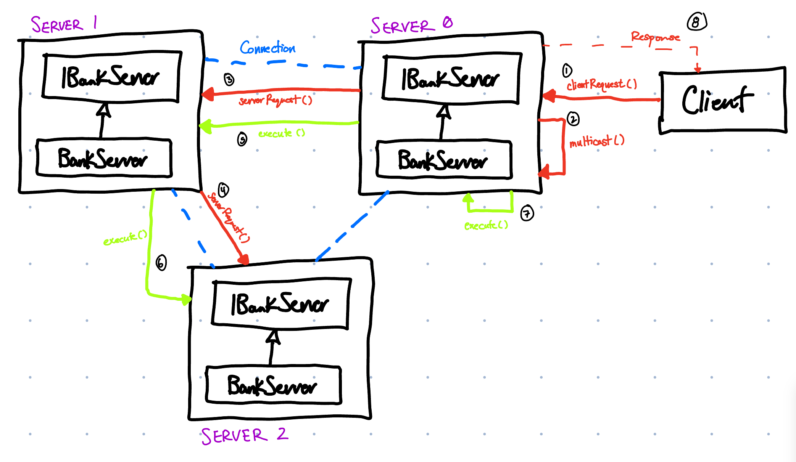
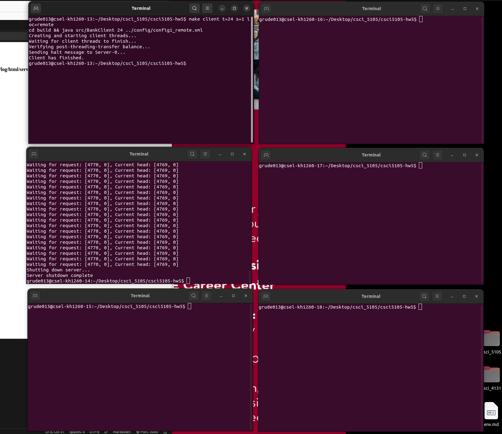
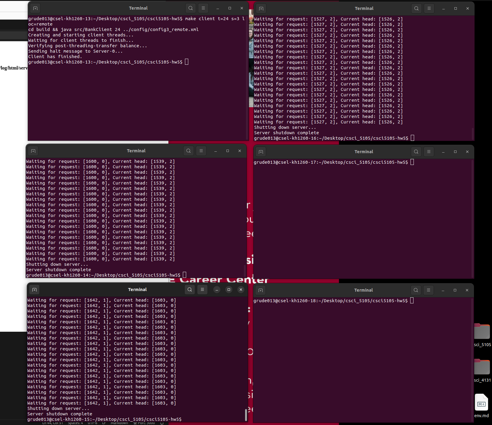
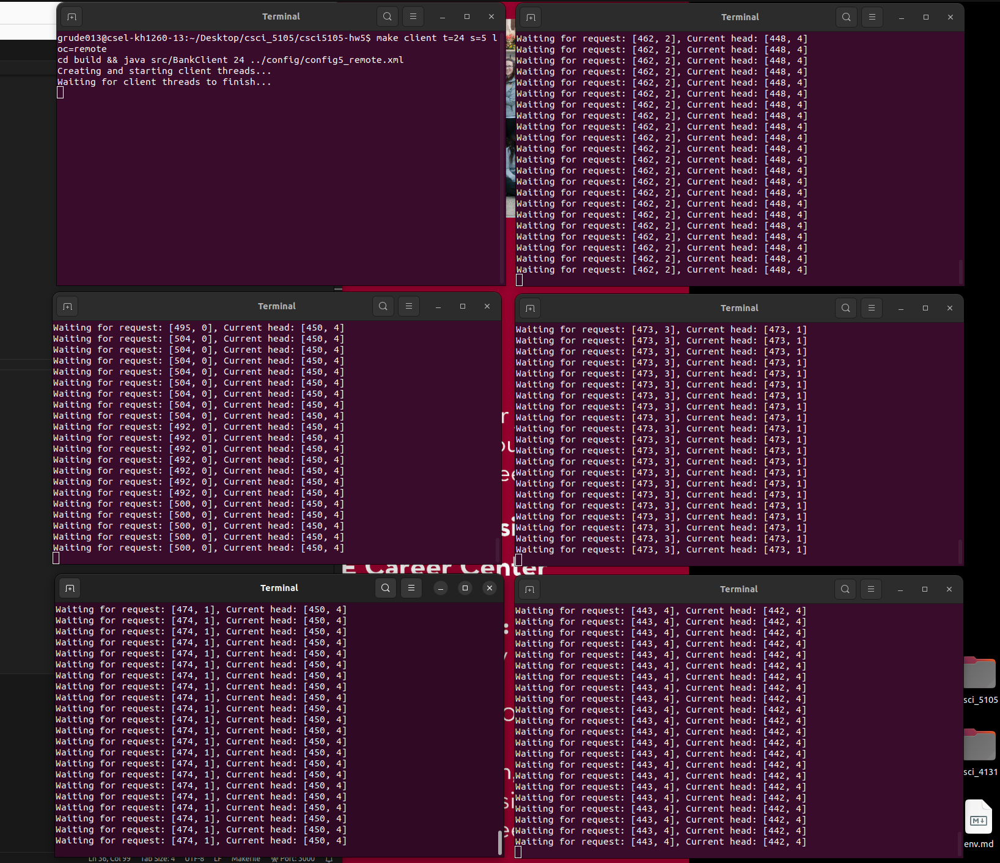

# Java RMI Distributed Banking System
## CSCI 5105 - Homework 5
Author: Jamison Grudem  
Email: grude013@umn.edu 
Using 2 grace days 

## About The Program
This program is a distributed banking system that uses Java Remote Method Invocation (RMI) for client-server communication and server-server peer communication for replicated server instances. Each server contains a ConcurrentHashMap that stores account information. Each account has a unique account number and a balance.   

Requests and responses are modeled as objects that are serialized and sent over the network. Requests and responses have an associated unique timestamp, created by a lamport clock (seen in `src/LamportClock.java`) that allows for the requests to be uniquely identified and executed in the same order across servers. Both Request `src/Request.java` and Response `src/Response.java` have been created using the Builder pattern, allowing request/response specification to be built using chaining methods:
```java
Request req = (new Request()).withType(Request.Type.TRANSFER).from(1).to(2).amount(100);

Response res = (new Response()).withSuccess(true);
```

The bank server, found in `src/BankServer.java`, which interfaces from `src/IBankServer.java`, contains the following primary methods:
### Internal Server Methods
* Create an account
    ```java
    // Returns the account number of the created account
    public int createAccount();
    ```
* Deposit money into an account
    ```java
    // Returns true if the deposit was successful, false otherwise
    public boolean deposit(int uid, int amount);
    ```
* Transfer money between accounts
    ```java
    // Returns true if the transfer was successful, false otherwise
    public boolean transfer(int fromUid, int toUid, int amount);
    ```
* Get the balance of an account
    ```java
    // Returns the balance of the account
    public int getBalance(int uid);
    ```
* Multicast a request to all peer servers
    ```java
    // Multicast a request to all peer servers
    public Response[] multicast(Request req);
    ```
### RMI Interface Methods
* Accept a new client request
    ```java
    // Accept a request from a client
    public Response clientRequest(Request req) throws RemoteException;    
    ```
* Accept a new server request
    ```java
    // Accept a request from another server - used in P2P mutlicast
    public Response serverRequest(Request req) throws RemoteException;
    ```
* Execute a request locally
    ```java
    // Execute a request locally
    public Response execute(Request req) throws RemoteException;
    ```
* Get the id of the server
    ```java
    // Return the id of the server
    public int getId() throws RemoteException;
    ```

Each server contains its own instance of a Lamport Clock Manager which increments its value on a new client or server request. The Lamport Clock Manager is used to ensure that requests are executed in the same order across all servers. The Lamport Clock Manager is found in `src/LamportClockManager.java`. Since we are running multiple replicated servers, data synchronization is necessary to ensure that all servers have the same data. This is done by using a peer-to-peer multicast system that sends requests to all servers.

View a brief design document of the system here:


### Project Structure
* Before compiling, the project structure is as follows:
  ```bash
  ├── .
    ├── assets      # Images used in this file and for more information
    ├── config      # Sample configuration files 
      ├── *.xml         
    ├── src         # Source code
      ├── *.java      
    ├── README.md   # This file
    ├── REPORT.md   # Performance evaluation
    ├── Makefile    # Used for complilation and running
  ```
* After compiling, the project structure is as follows. Note that `build` and `log` directories are created. An additional folder is created at `log/html` for an alternative view of logging. See the Logging section for more information.
  ```bash
  ├── .
    ├── assets    
    ├── build     # Compiled source code
      ├── *.class      
    ├── config     
    ├── log
      ├── html    # HTML log files
      ├── *.log   # Plain text log files
    ├── src         
    ├── README.md   
    ├── REPORT.md   
    ├── Makefile    
  ```

## Configuration Files
The program uses XML configuration files to specify the hostname, id, and port of each server. The configuration files are located in the `config` directory and are named corresponding to their host location (either local or remote) and the number of servers (1, 3, or 5). For example, a configuration file for a local setup with 3 servers would be named: `config3_local.xml`. The configuration files are structured as follows:
```xml
<config>
  <server>
      <hostname>{server hostname}</hostname> <!-- Ex: 'localhost', 'csel-kh1250-14.cselabs.umn.edu' -->
      <id>{server id}</id>  <!-- Ex: 0, 2, 4 -->
      <port>{server port}</port> <!-- Ex: 8014, 8018 -->
  </server>
</config>
```

When a configuration file is passed to a client execution, the client reads for each server, and creates a list of connections with the BankServer objects as specified in the file. When a configuration file is passed to a server execution, the server reads the configuration file and creates a list of connections to all servers except itself. Server execution is passed in a server id that is used to determine which server configuration to read for the current execution. More information is covered in the next section.

## How To Run The Program
### Compiling
All source code is located in the `src` directory. All output .class files are placed in the `build` directory. This program runs on predefined `make` commands. You can see the available commands and example usages in the `Makefile`.  

To compile the program, navigate to the root directory (directory containing this file) of the project and run the following command:
```bash
make
```

This will generate the `build` directory and a subdirectory `src` containing all the compiled .class files.

### Running The Server
The command to run the server takes 3 optional arguments:
| Argument | Description | Default |
|----------|-------------|---------|
| `id` | The id of the server to run | 0 |
| `s` | The number of servers to run | 1 |
| `loc` | The location of the servers ("local" or "remote") | local |

To run the program with the default arguments, run the following command:
```bash
make server
```

To run the program with custom arguments, see the example below:
```bash
make server id=0 s=3 loc=remote
```

The server execution will read the configuration file based on the `s` and `loc` arguments. In this case, the server reads the `config` directory for a file titled `config3_remote.xml`. Then, the server will scan the configuration file for the server id specified by the `id` argument. If the server id is not found in the configuration file, the server will exit with an error message. If the server id is found, the server will create a list of connections to all servers except itself. 

If a configuration specifies 3 servers and you are running the server with id 0, the server will continuously attempt to connect to the other servers listed in the configuration file until all servers are running and a connection is established between all servers. Make sure if you specify multiple servers in the configuration file that you are running all the servers. See the console output after running the server for more detailed information.

### Running The Client
The command to run the client takes 3 optional arguments:
| Argument | Description | Default |
|----------|-------------|---------|
| `s` | The number of servers to run | 1 |
| `loc` | The location of the servers ("local" or "remote") | local |
| `t` | The number of client threads to run | 24 |

To run the program with the default arguments, run the following command:
```bash
make client
```

To run the program with custom arguments, see the example below:
```bash
make client s=3 loc=remote t=12
```

The client execution will read the configuration file based on the `s` and `loc` arguments. In this case, the client reads the `config` directory for a file titled `config3_remote.xml`. The client will then create a list of connections to all servers. The client will then create `t` threads that will execute a series of requests to the servers. The client will then wait for all threads to finish before printing the results.

**NOTE: The client execution is dependent on the server execution. All specified servers must be running before the client execution.**

## Logging
The program uses a logging system (found in `src/Printer.java`) that logs to files in the `log` directory. The log system will create log files for the client as well as each unique server id. The client log file is named `client.log` and the server log files are named `server{id}.log`. Within this `log` directory, an additional directory `html` is created that contains HTML versions of the log files for easier viewing. The HTML log files are named similarily to the plain text log files and are the preferred method of analyzing the logs. ALl unique operations of the log files are color coded, and similar operations are logged in the same color with different shades.

### Client Log
The client log can be viewed at `log/client.log` or `log/html/client.html`. Each client log contains the columns:
| Column | Description |
|--------|-------------|
| `Thread` | The thread number that executed the request |
| `Server` | The server id that the request was sent to |
| `Operation` | The operation that was executed (REQ, RES, etc.) |
| `Timestamp` | The Lamport Clock timestamp of the request |
| `Message` | The message that was sent or received (TRANSFER, DEPOSIT, etc.) |
| `Parameters` | The parameters of the request (from, to, amount) |

The client log contains the following operations:
* `START` - The start of the client
* `REQ` - Request sent to a server
* `RES` - Response received from a server

### Server Log(s)
The server log can be viewed at `log/server{id}.log` or `log/html/server{id}.html`. Each server log contains the columns:
| Column | Description |
|--------|-------------|
| `Server` | The server id that the request was sent to |
| `Operation` | The operation that was executed (REQ, RES, etc.) |
| `Timestamp` | The Lamport Clock timestamp of the request |
| `Lamport Clock` | The Lamport Clock value at the time of the request |
| `Origin` | The server or client that the request originated from |
| `Message` | The message that was sent or received (TRANSFER, DEPOSIT, etc.) |
| `Parameters` | The parameters of the request (from, to, amount) |

The server log contains the following operations:
* `CLIENT-REQ` - Request received from a client
* `<- SRV-REQ` - Request received from another server
* `-> SRV-REQ` - Request sent to another server
* `SRV-RES` - Response received from another server
* `EXECUTE` - Request executed locally

## Performance Evaluation
Performance evaluation was collected for the average time between request and response for a transfer as observed by each individual client thread and each server. The average time for a transfer as observed by the client for each thread can be seen in the client log with a message titled `REPORT` in a dark purple color. Each server measures the time between a new client request and the time of execution for that request. It then averages this time for all requests executed by the server. The average time for a transfer as observed by each server can be seen in each server log with a message titled `REPORT` in a dark purple color.

You can view the full performance evaluation in the `REPORT.md` file.

## Testing
For test cases 1, 2, and 3 as listed in the assignment writeup, the following hosts/ports were used:
* `csel-kh1260-{14-18}.cselabs.umn.edu` with ports `80{14-18}`
  * `csel-kh1260-14.cselabs.umn.edu:8014`
  * `csel-kh1260-15.cselabs.umn.edu:8015`
  * `csel-kh1260-16.cselabs.umn.edu:8016`
  * `csel-kh1260-17.cselabs.umn.edu:8017`
  * `csel-kh1260-18.cselabs.umn.edu:8018`

See the `config` directory for the configuration files used for testing, which show the exact remote server configurations. See the images below to see the setup and output in the terminals.

<div style='display:flex;flex-direction:row;'>
    <div style='width: 33%'>
        <h2>Test Case 1</h2>
        
    </div>
    <div style='width: 33%'>
        <h2>Test Case 2</h2>
        
    </div>
    <div style='width: 33%'>
        <h2>Test Case 3</h2>
        
    </div>
</div>